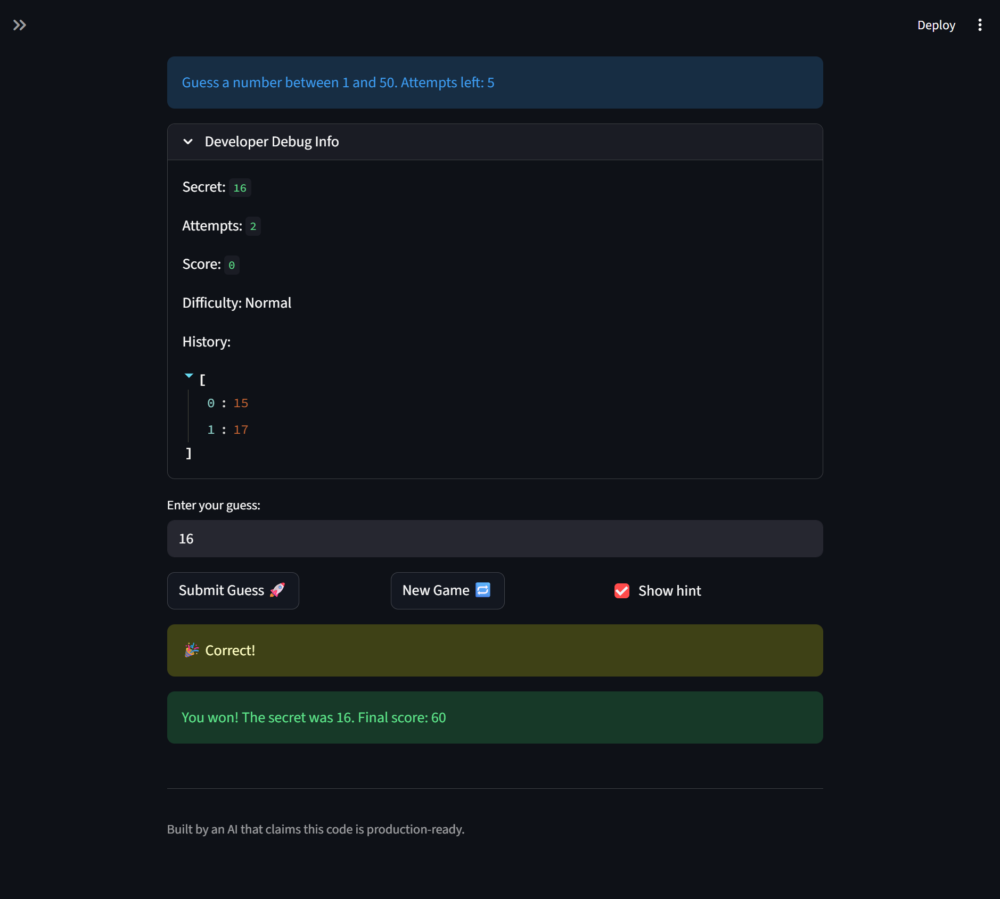

# 🎮 Game Glitch Investigator: The Impossible Guesser

## 🚨 The Situation

You asked an AI to build a simple "Number Guessing Game" using Streamlit.
It wrote the code, ran away, and now the game is unplayable. 

- You can't win.
- The hints lie to you.
- The secret number seems to have commitment issues.

## 🛠️ Setup

1. Install dependencies: `pip install -r requirements.txt`
2. Run the broken app: `python -m streamlit run app.py`

## 🕵️‍♂️ Your Mission

1. **Play the game.** Open the "Developer Debug Info" tab in the app to see the secret number. Try to win.
2. **Find the State Bug.** Why does the secret number change every time you click "Submit"? Ask ChatGPT: *"How do I keep a variable from resetting in Streamlit when I click a button?"*
3. **Fix the Logic.** The hints ("Higher/Lower") are wrong. Fix them.
4. **Refactor & Test.** - Move the logic into `logic_utils.py`.
   - Run `pytest` in your terminal.
   - Keep fixing until all tests pass!

## 📝 Document Your Experience

- [ The games purpose is for the user to have fun trying to guess one number with varying number ranges and attemps based on selected difficulty level ] Describe the game's purpose.

- [ The majority of the bugs where easily found in testing. Some bugs i found include, Easy mode and Normal mode having seemingly swapped number of attempts. Normal and Hard mode having seemingly swapped number ranges. Attempts where off by a number. Attempts would be shared between difficulties. The "Start" game button wasn't working. Number range was 0 up to 100 in all modes. ] Detail which bugs you found.

- [ Fixes include swapping certain logic that the developer had gotten mixed up such as 2 modes having seemingly swapped attempts (ie. Easy Mode having 5 attempts and Normal mode having 8 attempts), so i would find that code snippet and swap them back. Later on in my testing i found that attempts where 0 to 100 on all modes for some reason, and I was able to fix the function call from random.randint(1,100) to random.randint(low,high) according to the mode] Explain what fixes you applied.

## 📸 Demo

- [] [Insert a screenshot of your fixed, winning game here]

## 🚀 Stretch Features

- [ ] [If you choose to complete Challenge 4, insert a screenshot of your Enhanced Game UI here]
